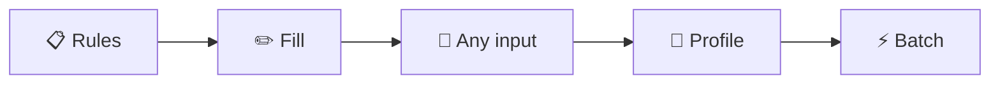

# PRD Graphics Ideas: Agent-Driven Chat UI

Ideas for **graphic images** to make `agent-chat-ui.md` easier to scan and understand. Each section maps to a place in the PRD and suggests what to draw and how.

---

## 1. Overview & Value Proposition

**Where:** Right after "Overview" (before Problem Statement)

**Graphic idea:** **Value pillars diagram**

- One simple diagram: 5 pillars (Understand form rules, Fill intelligently, Generate from any input, Remember user data, Power users).
- Style: Icons + short labels in a row or a 2×3 grid.
- Tool: Mermaid (flowchart), or a small illustration (Figma/Canva).

**Example structure (Mermaid):**

**Alternative:** One hero image: “User + chat + form → filled PDF” in 3 panels (before → agent → after).

---

## 2. Problem vs Desired State

**Where:** In "Problem Statement"

**Graphic idea:** **Before / After (or Current vs Desired)**

- Left: “Current” – manual, error-prone, rigid (icons: form, confusion, wrong field).
- Right: “Desired” – agent-guided, smart, conversational (icons: chat, checkmarks, happy user).
- Style: Two columns with simple icons and 1-line captions.
- Tool: Mermaid (quadrant or two boxes), or a 2-panel illustration.

---

## 3. User Journey (Example Scenario)

**Where:** In "User Goals" → "Example Scenario"

**Graphic idea:** **7-step user journey**

- One horizontal timeline: Upload → Agent analyzes → User confirms → Agent fills → Preview → User approves → Download.
- Each step: number + icon + 1 short phrase.
- Tool: Mermaid (flowchart LR), or a journey map in Figma/Miro.

---

## 4. Chat UI Layout (Core Screen)

**Where:** In "Core Features" → "1. Chat Interface"

**Graphic idea:** **Screen wireframe / layout diagram**

- Three columns: **Sidebar** (conversation list) | **Document preview** (PDF + zoom) | **Chat** (messages + input + drop zone).
- Annotate: “Left: preview”, “Right: chat”, “Drag & drop here”.
- Tool: Simple wireframe (Figma, Excalidraw, or Balsamiq), or a screenshot-style mockup.
- **High impact:** This is the main mental model; a single clear image here helps a lot.

---

## 5. Message Types

**Where:** After the "Message Types" table

**Graphic idea:** **Chat bubble types**

- One image showing 4–5 example bubbles: User message, Agent thinking (spinner), Agent message, Approval card (Accept/Edit), System message.
- Style: Chat UI mockup or screenshot with labels.
- Tool: Figma component screenshot or hand-drawn sketch.

---

## 6. Agent Decision Flow

**Where:** In "Agent Behavior" → "Decision Flow"

**Graphic idea:** **Flowchart** (replace or complement the ASCII block)

- Nodes: Upload → Analyze form → “20 fields: 8 required…” → Branch (source doc? / no source) → Extract or ask → Preview → User approve/edit → Generate PDF → Save/Download.
- Style: Vertical flowchart with diamonds for branches.
- Tool: Mermaid (`flowchart TD` with `-->` and `{ }` for conditionals).

---

## 7. Document Preview States

**Where:** In "3. Document Preview" → "States"

**Graphic idea:** **State diagram or state strip**

- Five states in sequence: Uploaded → Analyzing → Fields detected → Filled preview → Final.
- Each: small thumbnail (or icon) + state name.
- Tool: Mermaid stateDiagram or a horizontal strip of 5 frames.

---

## 8. Editing: Chat vs Click

**Where:** In "4. Editing Values"

**Graphic idea:** **Two paths diagram**

- Path 1: “Chat” – user types “Change name to…” → agent updates → preview.
- Path 2: “Click” – user clicks field → inline editor → type → Enter.
- Style: Two simple flows side by side with icons (keyboard, cursor).
- Tool: Mermaid or two small flowcharts.

---

## 9. Pipeline: User vs Internal

**Where:** In "Pipeline Integration"

**Graphic idea:** **Two-layer view**

- Top: What user sees (“Analyzing…”, “Mapping…”, “Filling…”, “Reviewing…”).
- Bottom: Internal stages (INGEST → STRUCTURE → … → REVIEW).
- Arrows: each user-facing label maps to 1+ internal stages.
- Tool: Mermaid (subgraph for “User sees” and “Agent uses”) or a simple 2-row diagram.

---

## 10. High-Level Architecture

**Where:** In "Technical Architecture" or "System Architecture"

**Graphic idea:** **Component diagram**

- Boxes: Document Validator, Template Service, Bbox Service, Agent (LLM), Chat UI, Storage, Redis, etc.
- Arrows: upload → Validator → … → Agent → Chat UI; Agent ↔ Services.
- Tool: Mermaid (flowchart or C4-style), or draw.io/Excalidraw.
- **Suggestion:** One “context” diagram (user + system boundary) and one “container” diagram (main services).

---

## 11. Data Model Overview

**Where:** At the start of "Data Models"

**Graphic idea:** **Entity relationship sketch**

- Main entities: Conversation, Message, Attachment, AgentState, UserProfile, BatchJob.
- Key relations: Conversation 1–* Message, Message *–* Attachment, Conversation 1–1 AgentState.
- Style: Boxes and lines; no need for full ER notation.
- Tool: Mermaid ER diagram or a simple boxes-and-arrows drawing.

---

## 12. User Flows (Happy Path)

**Where:** In "User Flows" → "Flow 1: Happy Path"

**Graphic idea:** **4–5 key frames** (replace or complement ASCII wireframes)

- Frame 1: Empty layout + “Drop files”.
- Frame 2: Two files uploaded + agent “I found form + source…”.
- Frame 3: Filled preview + “Approve / Edit”.
- Frame 4: “Done” + Download PDF.
- Style: Same 3-column layout in each frame; only content and highlights change.
- Tool: Wireframes or low-fidelity mockups (Figma/Excalidraw).

---

## 13. Golden Flow (Auto-fill First)

**Where:** In "The Golden Flow"

**Graphic idea:** **4-step horizontal flow**

- Steps: 1. User uploads (form + source) → 2. Agent auto-fills (silent) → 3. Show result (“Filled 45 fields” + preview) → 4. User adjusts (inline/chat) or downloads.
- Emphasize: “ZERO QUESTIONS until user edits”.
- Tool: Mermaid flowchart or a 4-panel illustration.

---

## 14. Template Matching Flow

**Where:** In "Template System" → "Template Matching Flow"

**Graphic idea:** **Flowchart**

- Upload form → Generate embedding → Vector search → Match? (Y: use template bboxes+rules / N: fresh analysis).
- Tool: Mermaid (`flowchart TD` with decision node).

---

## 15. Learning Flywheel

**Where:** In "Learning Flywheel"

**Graphic idea:** **Circular diagram**

- Steps: Manual templates → User fills → User corrects → Stored per form type → Next user benefits.
- Style: Circle or cycle with arrows.
- Tool: Mermaid (circular flowchart) or a simple cycle illustration.

---

## 16. Implementation Phases

**Where:** In "Implementation Phases"

**Graphic idea:** **Phase timeline**

- Horizontal bar or swimlane: Phase 0 → 1 → 2 → 3 → 4 with short labels (Setup, Core Agent, Template, Edit, SaaS).
- Optional: one bullet per phase (e.g. “Upload → fill → download” for Phase 1).
- Tool: Mermaid (timeline or Gantt-style) or a simple horizontal strip.

---

## 17. Scope In / Out

**Where:** In "Scope-Out Summary" or "Scope-Out Cases"

**Graphic idea:** **Venn or two lists**

- Left: “Out of scope” (Form creation, Non-PDF, Collaboration, Submission, Handwriting, Legal advice, Offline) with ❌.
- Right: “In scope / special” (Images, Non-AcroForm PDF, Scanned forms) with ✅.
- Tool: Two-column table rendered as a simple diagram, or Mermaid quadrant.

---

## 18. Parallel Agent Development

**Where:** In "Parallel Development with Agents"

**Graphic idea:** **Main agent + sub-agents**

- Center: “Main agent (planner)”.
- Below: 3–4 boxes (Backend, Frontend, Tests, Infra) with arrows up to main agent.
- Optional: “Integrate” step after sub-agents.
- Tool: Mermaid flowchart (top-down) or a simple org-chart style drawing.

---

## 19. Contract-First Parallel Flow

**Where:** In "Parallel Development Flow"

**Graphic idea:** **3-step process**

- Step 1: Main agent defines contracts (OpenAPI, types).
- Step 2: Sub-agents implement in parallel (4 boxes).
- Step 3: Main agent integrates (merge, tests).
- Tool: Mermaid (three subgraphs or three columns).

---

## 20. Priority Stack (Technical)

**Where:** In "Technical Priority Stack"

**Graphic idea:** **Stacked layers**

- Three horizontal bands: Priority 1 (Bbox detection), Priority 2 (Field labeling), Priority 3 (Value filling).
- Short bullet per layer.
- Tool: Mermaid (block diagram) or a 3-tier “stack” illustration.

---

## Suggested image folder and format

- **Path:** e.g. `docs/prd/images/` or `docs/prd/agent-chat-ui/`.
- **Naming:** `01-overview-pillars.svg`, `02-problem-desired.svg`, `04-chat-layout.svg`, etc. (number matches section order).
- **Formats:**
  - **Mermaid:** Keep `.md` snippets in the PRD or in a separate `docs/prd/diagrams/` and render to SVG (Mermaid CLI or GitHub/GitLab).
  - **Diagrams:** Export as SVG or PNG (2x for sharpness).
- **In the PRD:** Use standard Markdown: ``.

---

## Priority order (if doing incrementally)

| Priority | Graphic | Section | Why |
|----------|---------|---------|-----|
| 1 | Chat UI layout (3-column) | Core Features | Defines the main screen; referenced everywhere. |
| 2 | Golden flow (4 steps) | Design philosophy | Core “auto-fill first” behavior. |
| 3 | Agent decision flow | Agent behavior | Replaces long ASCII; clarifies logic. |
| 4 | User journey (7 steps) | User goals | Makes example scenario scannable. |
| 5 | Pipeline (user vs internal) | Pipeline integration | Clarifies abstraction. |
| 6 | Architecture (components) | Technical architecture | One-page system view. |
| 7 | Document preview states | Document preview | Clarifies UI states. |
| 8 | Scope in/out | Scope-out | Quick reference. |

---

## Tools summary

| Need | Tool |
|------|------|
| Flowcharts, sequences, ER, timelines | Mermaid (in-repo, render to SVG) |
| UI wireframes / layout | Figma, Excalidraw, Balsamiq |
| Icons + simple illustrations | Figma, Canva, or icon set (e.g. Heroicons) |
| Architecture (C4-style) | Mermaid, draw.io, Structurizr |
| Cycle / flywheel | Mermaid or simple circle diagram |

Adding even **5–6** of these (starting with layout, golden flow, decision flow, journey, pipeline, architecture) will make the PRD much easier to skim and use in discussions.
